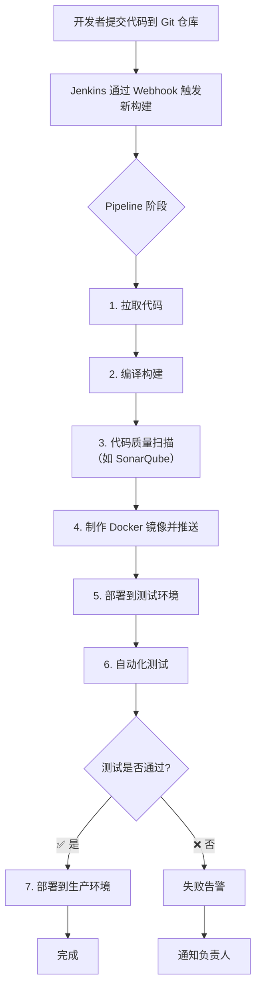

好的，我们来全面讲解一下如何使用 Jenkins 做 CI/CD（持续集成/持续部署）。

一、核心概念：CI/CD 是什么？

· CI（持续集成）：开发人员频繁地将代码集成到共享仓库（如 Git）中。每次集成都会通过自动化流程进行构建和测试，以便快速发现错误。
  · 关键动作：自动编译、运行单元测试、代码质量扫描、打包。
· CD（持续交付/持续部署）：在 CI 的基础上，将代码自动部署到不同的环境（测试、预生产、生产）。
  · 持续交付：自动化准备好可部署的软件包，但手动触发部署到生产环境。
  · 持续部署：自动化准备好软件包后，自动部署到生产环境（无需人工干预）。

Jenkins 就是一个用于搭建和实现这套自动化流程的强大工具。

---

二、为什么选择 Jenkins？

1. 开源且免费：拥有庞大的社区和生态系统。
2. 插件生态极其丰富：超过 1500 个插件，可以轻松集成各种工具（Git、Docker、Kubernetes、Jira、SonarQube 等）。
3. 高度可定制和可扩展：通过 Pipeline（流水线）代码化地定义复杂的构建部署流程。
4. 分布式构建：可以在多台机器（代理节点）上分发构建任务，轻松扩展。

---

三、Jenkins 的核心组件与工作流程

1. 核心组件

· Jenkins Controller：大脑，负责提供 UI、调度构建任务、管理用户等。
· Jenkins Agent：代理节点，负责执行具体的构建任务。Controller 可以将工作负载分发到不同的 Agent 上执行。
· Job / Project：定义一个构建任务，包括从哪里获取代码、如何构建、如何部署等。
· Pipeline：（现代 Jenkins 的核心） 使用代码（Jenkinsfile）来定义整个 CI/CD 流程，将原本独立的多个任务串联成一个完整的流水线。
· 插件：实现各种功能的扩展。

2. 基本工作流程

一个典型的 CI/CD 流水线在 Jenkins 中的流程如下：



---

四、两种关键任务类型

1. 自由风格项目：
   · 特点：通过 Web UI 界面进行配置，简单易上手。
   · 适用场景：非常简单的、独立的构建任务。
   · 缺点：配置复杂后难以维护，无法实现复杂的流水线。
2. Pipeline 项目：
   · 特点：使用 Jenkinsfile（一个文本文件）来定义整个构建流程。Jenkinsfile 可以用两种语法编写：
     · Declarative Pipeline：声明式语法，更结构化、更简单，是新手推荐。
     · Scripted Pipeline：脚本式语法，基于 Groovy，更灵活、更强大。
   · 优势：
     · 代码即流程：Jenkinsfile 可以和应用程序代码一起存放在 Git 仓库中，进行版本管理。
     · 可维护性：可以清晰地查看整个 CI/CD 流程。
     · 可暂停：流水线可以等待人工确认后继续执行（例如，手动确认是否部署到生产）。
     · 功能丰富：支持并行执行、重试、异常处理等复杂逻辑。

---

五、一个简单的 Pipeline 示例 (Jenkinsfile)

这个例子展示了如何用 Declarative Pipeline 定义一个构建 Docker 镜像的流程。

```groovy
pipeline {
    agent any // 定义在哪里执行，any 表示任何可用的代理

    stages {
        // 阶段 1: 获取代码
        stage('Checkout') {
            steps {
                git branch: 'main', url: 'https://github.com/your-org/your-app.git'
            }
        }

        // 阶段 2: 编译和单元测试
        stage('Build and Test') {
            steps {
                sh 'mvn clean package' // 对于 Java Maven 项目
                // 如果测试失败，Pipeline 会在此中止
            }
        }

        // 阶段 3: 构建 Docker 镜像
        stage('Build Docker Image') {
            steps {
                script {
                    dockerImage = docker.build "your-org/your-app:${env.BUILD_NUMBER}"
                }
            }
        }

        // 阶段 4: 推送镜像到仓库
        stage('Push Image') {
            steps {
                script {
                    docker.withRegistry('https://registry.hub.docker.com', 'docker-hub-credentials') {
                        dockerImage.push()
                    }
                }
            }
        }

        // 阶段 5: 部署到 Kubernetes
        stage('Deploy to K8s') {
            steps {
                sh 'kubectl set image deployment/your-app your-app=your-org/your-app:${env.BUILD_NUMBER} --namespace=your-namespace'
            }
        }
    }

    // 流水线完成后可以发送通知
    post {
        success {
            slackSend channel: '#ci-cd', message: "构建成功! - ${env.JOB_NAME} ${env.BUILD_NUMBER}"
        }
        failure {
            slackSend channel: '#ci-cd', message: "构建失败! - ${env.JOB_NAME} ${env.BUILD_NUMBER}"
        }
    }
}
```

---

六、最佳实践

1. Pipeline as Code：将 Jenkinsfile 存储在项目根目录，与源码一同版本化管理。
2. 使用 Agent：不要让所有任务都在 Controller 上运行，使用 Agent 来分担负载，保持 Controller 稳定。
3. 善用插件：利用插件集成生态工具，但不要过度依赖，保持流水线简洁。
4. 安全第一：使用 Jenkins 的 “凭据” 功能管理密码、密钥等敏感信息，切勿明文写在 Pipeline 中。
5. 保持流水线快速：优化各个阶段，快速反馈是 CI/CD 的核心价值。
6. 设计清晰的阶段：将流程分解为逻辑清晰的阶段（Stage），便于排查问题和查看日志。

总结

Jenkins 是一个功能极其强大且灵活的 CI/CD 自动化引擎。它的核心优势在于：

· 通过插件集成一切。
· 通过 Pipeline 定义一切。

虽然现在有 GitLab CI、GitHub Actions、ArgoCD 等更多现代工具，但 Jenkins 由于其极高的定制性和成熟的生态，仍然是许多中大型企业构建复杂 CI/CD 流程的首选。学习 Jenkins 的核心是理解 Pipeline 即代码 的思想。