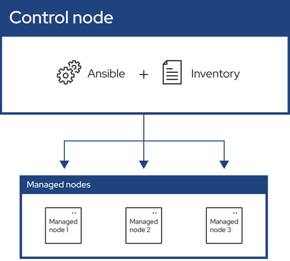

# 快速上手Ansible

一、Ansible 是什么？

Ansible 是一款自动化运维工具，基于 Python 开发。它主要用于配置管理、应用部署、任务自动化等。它的核心特点是：

1. 无代理（Agentless）：不需要在目标服务器上安装任何客户端软件，仅通过 SSH（Linux）或 WinRM（Windows）协议进行通信。
2. 简单易读：使用 YAML 语言描述自动化任务，语法非常直观，被称为 Playbook。
3. 幂等性（Idempotent）：同一个 Playbook 多次执行，效果是一样的。如果系统已处于目标状态，Ansible 不会做任何改变。

---

二、核心概念
# TODO set as table
|概念 | 说明 | 类比 ||
|---|---|---|---|
| 控制节点（Control Node） 安装了 Ansible 的机器，用于发起和执行自动化任务。 你的笔记本电脑或跳板机。
受管节点（Managed Nodes） 被 Ansible 管理的服务器设备列表，也称为“主机”（Hosts）。 你需要配置的 Web 服务器、数据库服务器等。
清单（Inventory） 一个文本文件（通常是 ini 或 yaml 格式），定义了你的受管主机列表，并可以对主机进行分组。 hosts.ini 文件，里面写了服务器的 IP 和分组。
模块（Module） Ansible 执行的单个功能单元。Ansible 提供了大量内置模块。 例如：copy（复制文件）、yum（安装包）、service（管理服务）。
任务（Task） 调用一个模块并指定其参数，这就是一个任务。 “使用 yum 模块安装 nginx” 就是一个任务。
剧本（Playbook） 一个 YAML 格式的文件，它将多个任务组织在一起，形成一个自动化的流程。 一个完整的应用部署脚本，包含安装、配置、启动等步骤。
角色（Role） 一种更高级的组织方式，用于自动加载相关的变量、任务、处理程序等，实现代码的复用和共享。 类似于编程中的“函数”或“类”，比如一个 nginx 角色。

---

三、快速开始

1. 安装 Ansible

在你的控制节点上安装（以 Ubuntu 为例）：

```bash
sudo apt update
sudo apt install ansible -y
```

2. 配置清单（Inventory）

创建一个名为 hosts.ini 的文件：

```ini
# 定义一台单独的主机
[web]
192.168.1.100 ansible_ssh_private_key_file=~/.ssh/id_rsa ansible_user=root

[db]
192.168.1.101

# 定义一个组，包含上面两个组
[prod:children]
web
db
```

· [web] 和 [db] 是主机组。
· 可以在主机后直接指定连接变量，如用户、私钥等。

3. 临时命令（Ad-Hoc Commands）

不写 Playbook，直接通过命令行执行简单任务。非常适合快速验证和一次性操作。

格式：ansible -i <清单文件> <主机或组> -m <模块> -a "<参数>"

示例：

· Ping 所有 web 组的主机：
  ```bash
  ansible -i hosts.ini web -m ping
  ```
· 在 web 组主机上执行 shell 命令（查看磁盘空间）：
  ```bash
  ansible -i hosts.ini web -m shell -a "df -h"
  ```
· 在 db 组主机上安装软件包（如安装 vim）：
  ```bash
  ansible -i hosts.ini db -m apt -a "name=vim state=present" --become
  ```
  · --become：表示以 sudo 权限执行。

4. 编写剧本（Playbook）

这是 Ansible 的核心。创建一个 deploy_nginx.yml 文件：

```yaml
---
- name: 部署并启动 Nginx         # Playbook 的描述
  hosts: web                    # 目标主机组，来自 inventory
  become: yes                   # 是否提权（sudo）
  
  tasks:                        # 任务列表
    - name: 安装 Nginx 包        # 第一个任务描述
      apt:                      # 使用 apt 模块（对于 Ubuntu）
        name: nginx             # 包名
        state: latest           # 状态：最新版

    - name: 复制自定义首页       # 第二个任务描述
      copy:                     # 使用 copy 模块
        src: files/index.html   # 本地文件路径（相对于 Playbook）
        dest: /var/www/html/index.html # 目标路径

    - name: 确保 Nginx 服务正在运行
      service:                  # 使用 service 模块
        name: nginx
        state: started          # 状态：启动
        enabled: yes            # 开机自启
```

执行这个 Playbook：

```bash
ansible-playbook -i hosts.ini deploy_nginx.yml
```

Ansible 会清晰地展示整个执行过程，包括每个任务的执行结果（ok, changed, failed）。

---

四、常用模块速查

模块名 用途 常用参数示例
copy 复制文件到远程主机 src: path/to/local/file dest: /path/to/remote/file
template 复制模板（可渲染变量） src: template.j2 dest: /path/to/file (模板文件通常以 .j2 结尾)
apt/yum 包管理（Ubuntu/RHEL） name: package_name `state: present
service 管理服务 name: service_name `state: started
file 管理文件和目录 path: /path/to/file `state: touch
user 管理用户账户 name: username `state: present
command/shell 执行命令 cmd: "ls -l" (注意：它们不处理模块参数，通常用更专业的模块代替)
debug 打印调试信息 msg: "Hello World" var: some_variable

---

五、最佳实践与提示

1. 使用 Roles：当 Playbook 变得复杂时，立即使用 ansible-galaxy init <role_name> 创建角色，将任务、变量、文件、模板组织到独立的目录结构中。
2. 利用变量：不要在 Playbook 中写死配置。使用 vars: 或在单独的 group_vars/, host_vars/ 目录中定义变量。
3. 使用 `--check` 模式：执行 Playbook 时加上 --check 参数，可以进行“模拟运行”，告诉你哪些地方会发生变化，而不会实际执行。
4. 标签（Tags）：给任务打上标签（tags: ['setup', 'config']），然后可以用 --tags "setup" 来只运行特定任务，非常灵活。

总结

Ansible 的学习路径非常平滑：

1. 从 Ad-Hoc 命令开始，快速操作服务器。
2. 编写简单的 Playbook，将多个任务自动化。
3. 使用变量和模板，让 Playbook 更灵活。
4. 重构为 Roles，实现代码的复用和共享。

记住核心：清单定义目标，模块执行操作，任务调用模块，Playbook 组织任务。