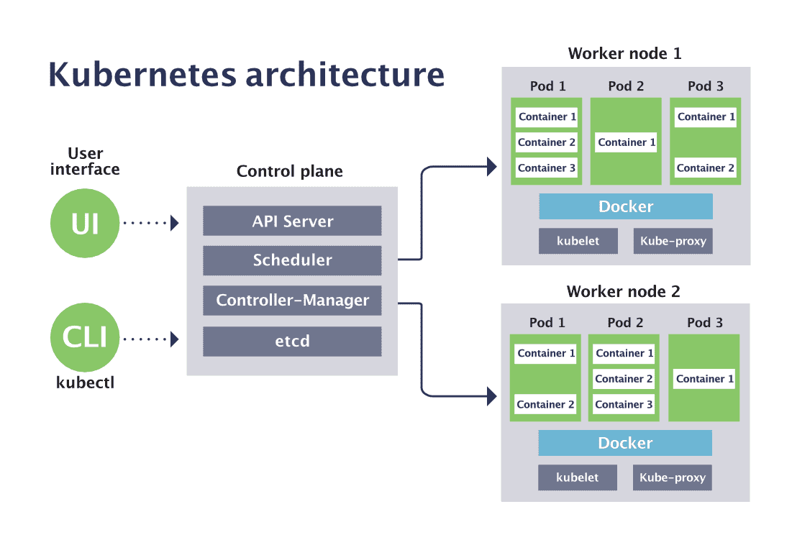

## etcd
好的，我们来详细讲解 Kubernetes 中 etcd 的角色和作用。

一句话概括：

etcd 是 Kubernetes 的“大脑”或“唯一真相源（Single Source of Truth）”。它是一个高性能、高可用的分布式键值存储（Key-Value Store），Kubernetes 集群的所有核心数据都持久化在 etcd 中。

你可以把 Kubernetes 想象成一个操作系统，而 etcd 就是这个操作系统的注册表或配置数据库。如果 etcd 丢失或损坏，整个集群的状态就会丢失，集群将无法正常工作。

---

为什么 Kubernetes 需要 etcd？

Kubernetes 的核心是“声明式 API”。你告诉 Kubernetes 你“期望”的状态（Desired State），比如“我需要运行 3 个 Nginx 副本”，Kubernetes 的控制平面（Control Plane）会不断地调整当前状态（Current State），使其与期望状态一致。

为了完成这个协调过程，系统必须有一个地方来可靠地存储这个至关重要的“期望状态”和“当前状态”。这个地方就是 etcd。

---

etcd 具体存储哪些数据？

几乎 Kubernetes 集群的所有状态信息都存储在 etcd 中，包括但不限于：

1. 节点（Node）信息：集群中有哪些 Worker 节点，它们的状态（Ready、NotReady）、资源容量等。
2. Pod 信息：每个 Pod 的配置、规格、状态、所在节点、IP 地址等。
3. 服务（Service）和端点（Endpoints）：Service 的 IP 地址、端口与后端 Pod（Endpoints）的映射关系。
4. 配置信息：Secrets（密码、令牌）、ConfigMaps（配置文件）、ServiceAccounts 等敏感和非敏感配置。
5. 部署状态：Deployment、StatefulSet、DaemonSet 等控制器管理的副本数量、更新策略、当前状态和历史版本（用于回滚）。
6. 网络规则：Ingress 规则、网络策略（Network Policies）。
7. 持久化存储：PersistentVolume（PV）和 PersistentVolumeClaim（PVC）的绑定信息。
8. RBAC 规则：角色（Role）和角色绑定（RoleBinding）的访问控制规则。

简单来说，你在 `kubectl get <resource>` 时看到的所有信息，其源头几乎都来自 etcd。

---

etcd 在 Kubernetes 架构中的位置

etcd 是 Kubernetes 控制平面（Control Plane） 的核心组件之一，与其他核心组件紧密协作：

· API Server：这是唯一能直接与 etcd 通信的组件。所有其他组件（如 kube-scheduler, kube-controller-manager, kubelet）都必须通过 API Server 来读写数据。
  · 写操作：当你执行 kubectl apply 时，请求首先到达 API Server，API Server 验证后，将数据写入 etcd。
  · 读操作：当 kube-scheduler 需要为 Pod 寻找一个合适的节点时，它通过 API Server 从 etcd 中读取节点信息。
  · Watch 机制：组件可以通过 API Server 监听（Watch） etcd 中资源的变化。例如，当你在 etcd 中创建一个新的 Pod 记录时，kube-scheduler 会立刻收到通知，从而开始调度工作。

这种设计带来了几个好处：

1. 安全性：只有 API Server 能访问后端存储，起到了保护和代理的作用。
2. 一致性：所有组件都通过一个中央接口访问数据，保证了数据视图的一致性。
3. 可扩展性：可以方便地替换后端存储（虽然目前生产环境几乎只用 etcd）。

---

etcd 的关键特性

Kubernetes 选择 etcd 不是偶然的，因为它具备分布式系统所需的关键特性：

1. 强一致性（Strong Consistency）：集群中的所有 etcd 节点在任何给定时刻拥有相同的数据。读操作总是能获取到最新的写入数据，这对于协调任务至关重要。
2. 高可用性（High Availability）：通常以奇数个节点（如 3, 5, 7）组成集群。即使少数节点发生故障，集群也能继续正常运行，数据不会丢失。
3. Watch 机制：客户端可以监听键值的变化。Kubernetes 组件利用这个特性来实时感知集群状态的变化，并做出反应。
4. 租约（Lease）与心跳：用于实现分布式锁和 TTL（生存时间）。Kubernetes 用它来检测 Node 节点是否存活（Node 上的 kubelet 会定期更新 etcd 中的租约）。
5. 数据持久化：数据会可靠地存储在磁盘上，防止重启后数据丢失。
6. 高性能：读写速度极快，能承受 Kubernetes API 的高并发请求。

---

总结与类比

角色 功能 类比
Kubernetes API Server 集群的前台和网关，处理所有请求。 公司的前台接待处，所有访客必须在此登记。
etcd 集群的大脑和数据库，存储所有状态。 公司的中央档案室，所有重要文件都存放在这里。前台会来这里存取文件。
其他组件（Scheduler等） 集群的各部门经理，负责具体工作。 部门经理需要文件时，必须向前台申请，他们不能直接进入档案室。

重要提示：

· 备份！备份！备份！：由于 etcd 包含了整个集群的状态，定期备份 etcd 是生产环境运维中最重要的工作之一。这样可以在灾难发生时恢复集群。
· 访问控制：etcd 存储了如 Secret 之类的敏感信息，必须通过严格的 TLS 证书认证和网络策略来保护其安全。
· 性能关键：etcd 的性能直接决定了整个 Kubernetes 集群的响应速度，因此需要为它配备高性能的 SSD 磁盘。