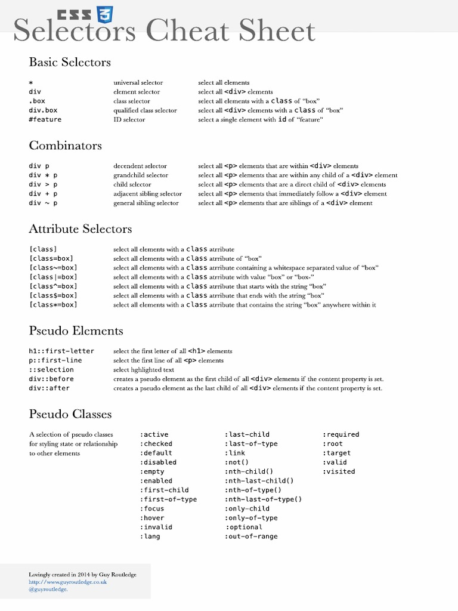
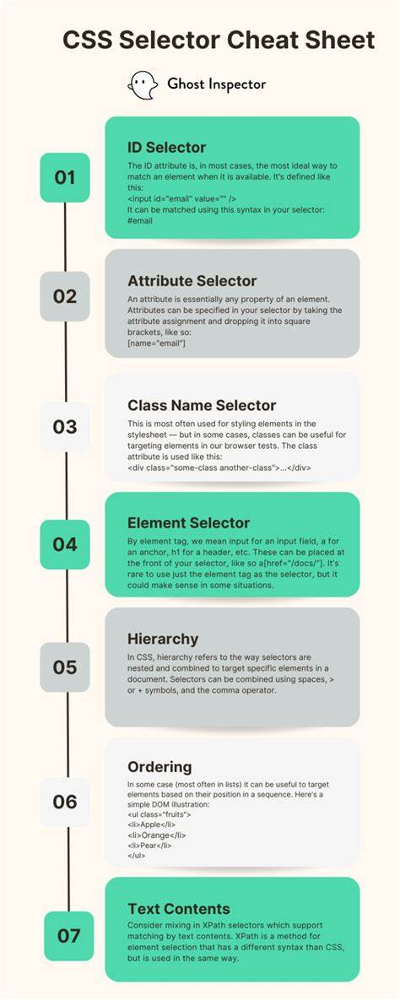
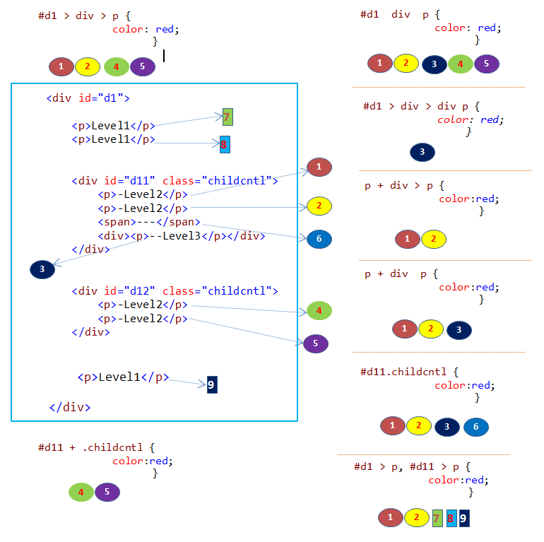

# CSS Selectors Complete Guide

## CheatSheet

- cheatsheet


- step to locate element


- example




## All CSS Selectors Reference

| Selector | Example | Description |
|----------|---------|-------------|
| **Basic Selectors** |
| Element | `p`, `div`, `h1` | Select all elements of a specific type |
| Class | `.highlight`, `.button` | Select elements with specific class |
| ID | `#header`, `#main-content` | Select element with specific ID (unique) |
| Universal | `*` | Select all elements |
| **Combinators (Relationship Selectors)** |
| Descendant (Space) | `div p` | Select all p elements inside div (at any nesting level) |
| Descendant with wildcard | `div * p` | Select p elements that are NOT direct children of div, but descendants of other elements inside div |
| Child (>) | `div > p` | Select direct children only |
| Adjacent Sibling (+) | `h1 + p` | Select immediate next sibling |
| General Sibling (~) | `h1 ~ p` | Select all following siblings |
| **Attribute Selectors** |
| Has attribute | `input[type]` | Elements with specific attribute |
| Exact value | `input[type="text"]` | Elements with exact attribute value |
| Contains word | `[class*="btn"]` | Attribute value contains substring |
| Starts with | `[class^="btn-"]` | Attribute value starts with string |
| Ends with | `[class$="-primary"]` | Attribute value ends with string |
| Contains word (space-separated) | `[class~="active"]` | Attribute contains word (space-separated) |
| Exact or starts with hyphen | `[class\|="lang"]` | Exact match or starts with followed by hyphen |
| **State-based Pseudo-classes** |
| Link states | `a:link`, `a:visited`, `a:hover`, `a:active` | Different states of links |
| Form states | `input:focus`, `input:disabled`, `input:checked` | Form element states |
| User interaction | `:hover`, `:focus`, `:active` | User interaction states |
| **Position-based Pseudo-classes** |
| First/Last child | `li:first-child`, `li:last-child` | First or last child element |
| Specific position | `li:nth-child(3)` | Element at specific position |
| Odd/Even | `li:nth-child(odd)`, `li:nth-child(even)` | Odd or even positioned elements |
| Pattern | `li:nth-child(3n+1)` | Elements matching pattern (every 3rd starting from 1st) |
| Only child | `p:only-child` | Element that is the only child |
| **Type-based Pseudo-classes** |
| First/Last of type | `p:first-of-type`, `p:last-of-type` | First or last element of its type |
| Specific position of type | `p:nth-of-type(2)` | Element at specific position of its type |
| Only of type | `p:only-of-type` | Element that is the only one of its type |
| **Other Pseudo-classes** |
| Negation | `:not(.hidden)` | Elements that don't match selector |
| Empty | `div:empty` | Elements with no children |
| Root | `:root` | Root element of document |
| **Pseudo-elements** |
| First line | `p::first-line` | First line of text |
| First letter | `p::first-letter` | First letter of text |
| Before content | `.button::before` | Insert content before element |
| After content | `.button::after` | Insert content after element |
| Selection | `::selection` | Selected text |
| **Multiple Selectors** |
| Group | `h1, h2, h3` | Apply same styles to multiple selectors |

## Specificity Examples

| Selector | Specificity | Description |
|----------|-------------|-------------|
| `p` | 0,0,0,1 | Element selector |
| `p.highlight` | 0,0,1,1 | Element + class |
| `p#intro` | 0,1,0,1 | Element + ID |
| `p#intro.highlight` | 0,1,1,1 | Element + ID + class |

## Practical Examples

### Navigation Menu
```css
.nav { background: #333; }
.nav > li { display: inline-block; }
.nav > li > a { color: white; text-decoration: none; }
.nav > li > a:hover { background: #555; }
.nav > li.active > a { background: #007bff; }
```

### Form Styling
```css
.form-group { margin-bottom: 15px; }
.form-group > label { display: block; font-weight: bold; }
.form-group > input[type="text"],
.form-group > input[type="email"] { width: 100%; padding: 8px; }
.form-group > input:focus { border-color: #007bff; outline: none; }
.form-group > input:invalid { border-color: #dc3545; }
```

### Card Layout
```css
.card { border: 1px solid #ddd; border-radius: 4px; }
.card > .card-header { padding: 15px; border-bottom: 1px solid #ddd; }
.card > .card-body { padding: 15px; }
.card > .card-footer { padding: 15px; border-top: 1px solid #ddd; }
.card:hover { box-shadow: 0 2px 8px rgba(0,0,0,0.1); }
```

### Responsive Grid
```css
.row { display: flex; flex-wrap: wrap; }
.col { flex: 1; padding: 0 15px; }
.col:nth-child(1) { flex-basis: 25%; }
.col:nth-child(2) { flex-basis: 50%; }
.col:nth-child(3) { flex-basis: 25%; }
```

## Browser Support

| Selector | Browser Support |
|----------|----------------|
| Basic selectors | All browsers |
| Attribute selectors | IE7+ |
| `:not()` | IE9+ |
| `nth-child()` and `nth-of-type()` | IE9+ |
| `::before` and `::after` | IE8+ (with single colon) |
| Modern pseudo-elements | IE9+ |

## Best Practices

1. **Use classes for reusable styles**
2. **Avoid overly specific selectors**
3. **Use semantic class names**
4. **Consider specificity when organizing CSS**
5. **Use pseudo-classes for interactive states**
6. **Test across different browsers**


