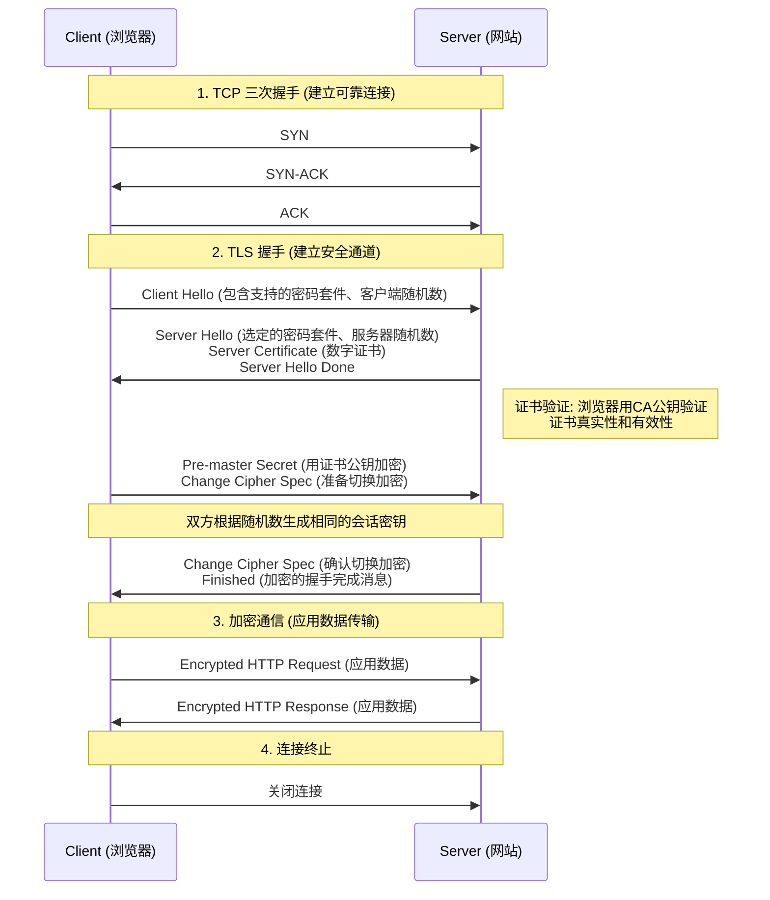
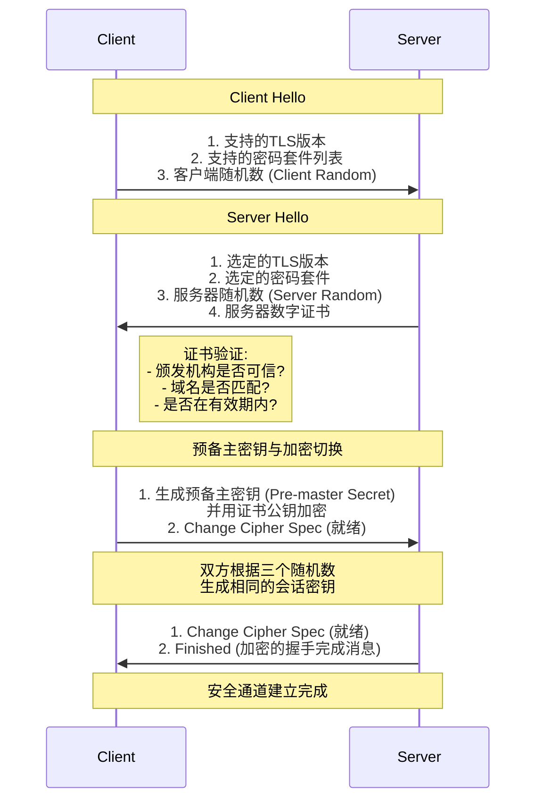
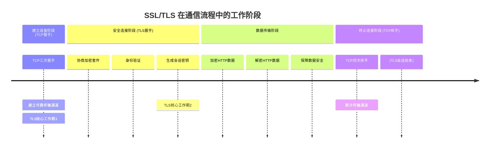
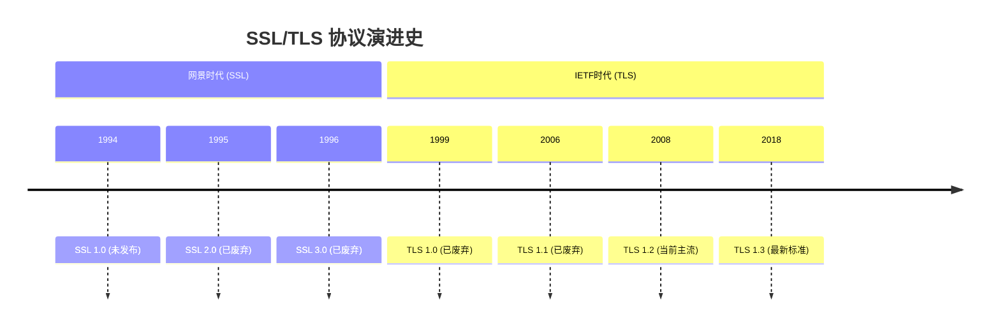

## HTTPS 的运行流程
好的，HTTPS 的运行流程（通常也称为 SSL/TLS 握手流程）是保证网络通信安全的核心。下面我将用一个清晰、分步的方式为您解释。

核心概念：HTTPS 是什么？

HTTPS 并不是一个新的应用层协议。可以理解为：

HTTP + SSL/TLS = HTTPS

- HTTP：负责传输内容的协议。
- SSL/TLS：负责在 HTTP 之下、TCP 之上建立一个安全的加密通道，对传输的 HTTP 内容进行加密和解密。

所以，HTTPS 的运行流程就是先建立安全连接，再进行通信。

---

HTTPS 完整工作流程（简化版）

整个流程可以概括为四大阶段：

1. TCP 三次握手：首先建立可靠的 TCP 连接。
2. TLS 握手协商：核心阶段，协商加密套件、验证身份、生成会话密钥。
3. 加密通信：使用协商好的会话密钥加密和解密数据。
4. 连接终止：通信结束，关闭连接。

下图清晰地展示了这一核心过程，您可以结合下文的具体步骤进行理解：

---

TLS 握手阶段详解（核心中的核心）

这是最关键的环节，下图以 RSA 密钥交换为例，详细说明了握手步骤：

---

为什么这个过程是安全的？

1. 保密性 (Confidentiality)：使用对称加密算法（如 AES）加密通信数据。对称加密的密钥（会话密钥）每次连接都是随机生成的，且通过非对称加密安全地交换，第三方无法获取。
2. 完整性 (Integrity)：使用散列算法（如 SHA256）生成消息认证码 (MAC)，确保数据在传输过程中未被篡改。
3. 认证性 (Authentication)：通过数字证书验证服务器的身份，防止中间人攻击。你连接的就是你想要的网站，而不是一个假冒的。

总结

步骤 主要目的 关键输出
1. TCP 握手 建立可靠的传输层连接 准备好了原始的数据传输通道
2. TLS 握手 身份验证、协商加密算法、生成密钥 建立了安全的加密通道，生成了会话密钥
3. 加密通信 在安全通道上传输加密的 HTTP 数据 受保护的应用程序数据（HTTP请求/响应）
4. 连接终止 安全地关闭连接 连接结束，会话密钥被丢弃

简单来说，HTTPS 的运行流程就是先敲门、验明正身、共同制定一个秘密暗号、然后用这个暗号交流，最后道别。这个过程确保了我们在互联网上传输的敏感信息的安全性。

好的，这是一个非常关键的问题。SSL/TLS 协议主要在通信的建立连接阶段和整个数据传输阶段发挥作用，但在连接终止阶段不直接参与。

简单来说，它的工作阶段可以概括为：在 TCP 连接之上，应用层数据传输之前和之中。

下图清晰地展示了 SSL/TLS 在整体网络通信中的介入时机与工作阶段：

---

各阶段详细说明

1. 建立连接阶段 - TCP 三次握手

- TLS 的角色：尚未参与。
- 发生了什么：客户端和服务器首先通过 TCP 三次握手建立一条可靠的、面向连接的通信通道。这是所有后续通信的基础。你可以把它看作“先把电话接通”。

2. 安全连接建立阶段 - TLS 握手（核心阶段）

- TLS 的角色：全面参与并主导。这是 TLS 最复杂、最核心的部分。
- 发生了什么：在 TCP 连接建立之后，应用程序（如浏览器）发送数据之前，立即进行 TLS 握手。这个过程包括：
  - 协商：双方协商将使用的 TLS 版本号、加密套件（如 ECDHE-RSA-AES256-GCM-SHA384）。
  - 身份验证：服务器（有时也包括客户端）通过出示数字证书来验证身份。
  - 密钥交换：通过非对称加密算法（如 RSA 或 ECDHE）安全地生成一个只有双方知道的对称会话密钥。
- 结果：此后，双方都拥有了相同的会话密钥， ready to在一条安全的通道上进行通信。

3. 数据传输阶段 - 加密通信

- TLS 的角色：持续工作。
- 发生了什么：TLS 握手完成后，应用程序数据（如 HTTP 请求、响应）才会开始传输。此时，所有这些数据都会被 TLS 记录协议进行处理：
  - 分块：数据被分割成 manageable 的片段。
  - 加密与认证：使用握手阶段生成的对称会话密钥对这些片段进行加密和计算消息认证码 (MAC)。
  - 传输：加密后的数据通过之前建立好的 TCP 连接进行传输。
  - 解密与验证：接收方收到数据后，用会话密钥解密并验证 MAC，确保数据的保密性和完整性。
- 结果：即使数据包被截获，攻击者也无法 decipher 其内容或篡改而不被发现。

4. 连接终止阶段 - TCP 四次挥手

- TLS 的角色：不再参与。
- 发生了什么：当通信结束时（例如，网页加载完成），双方会通过 TCP 的四次挥手来断开 TCP 连接。
- TLS 的后续：TCP 连接断开后，为该会话生成的会话密钥会被丢弃。下次再建立连接时，会完全重新进行 TLS 握手过程（或使用更高效的会话恢复机制），生成全新的会话密钥，这提供了前向安全性。

---

总结对比

通信阶段 TCP 的角色 SSL/TLS 的角色 结果
1. 建立连接 主导（三次握手） 未参与 建立了一条可靠的传输通道
2. 安全握手 承载 TLS 握手数据 主导（密钥协商与身份验证） 在传输通道上建立了一条安全加密通道
3. 数据传输 承载 加密后的数据 主导（加密/解密应用数据） 应用数据在安全通道中受到保护
4. 终止连接 主导（四次挥手） 不再参与（密钥被丢弃） 安全通道和传输通道都被关闭

## SSL和TLS有什么关系
好的，SSL 和 TLS 的关系非常简单直接：

TLS 是 SSL 的升级版和标准化版本。 我们现在日常生活中所说的“SSL”其实通常指的就是 TLS。

您可以这样理解： SSL 3.0 → TLS 1.0 → TLS 1.1 → TLS 1.2 → TLS 1.3

它们之间的关系类似于 Windows 95, Windows 98, Windows XP, Windows 7 等迭代关系。新版本修复了旧版本的漏洞，并提供了更强、更快的安全性。

下面是一个详细的对比和演进历史，帮助您彻底理解：

---

演进历史与时间线

版本 推出年份 状态与说明
SSL 1.0 1994 从未公开。由网景公司（Netscape）开发，因存在严重安全缺陷而未发布。
SSL 2.0 1995 已废弃。第一个公开发布的版本，但设计上有根本性安全缺陷，早在 2011 年就被禁用。
SSL 3.0 1996 已废弃。对 SSL 2.0 进行了全面重设计，非常成功但也已过时。2014年因受到 POODLE 攻击而被认为不安全，所有现代系统均已禁用。
TLS 1.0 1999 已废弃。由 IETF 基于 SSL 3.0 标准化而成。可视为 SSL 3.1。多年来一直是最低标准，但现在已被主流操作系统和浏览器禁用。
TLS 1.1 2006 已废弃。增加了对 CBC 攻击（如 BEAST）的防护。可视为 SSL 3.2。现已基本被 TLS 1.2/1.3 取代。
TLS 1.2 2008 目前（2023年）的主流和最低标准。提供了更强的加密算法和灵活性（如支持 AES-GCM，SHA256）。可视为 SSL 3.3。目前绝大多数网站都支持此版本。
TLS 1.3 2018 最新、最快、最安全的版本。简化了握手过程（速度更快），移除了不安全的加密算法，安全性大幅提升。可视为 SSL 3.4。正在迅速普及。

---

主要区别（TLS 相对于 SSL 的改进）

虽然 TLS 源于 SSL，但后续版本在安全性和性能上有了巨大提升：

1. 更强的加密算法：
   - TLS 移除了 SSL 中使用的弱加密算法（如 RC4、MD5），支持更安全可靠的算法（如 AES-GCM、SHA256/384）。
   - TLS 1.3 更是大刀阔斧地砍掉了所有不安全的算法，只保留了极少数绝对安全的选项。
2. 更快的连接速度（尤其是 TLS 1.3）：
   - TLS 1.3 将握手过程从传统的 2次往返（2-RTT） 减少到了 1次往返（1-RTT），甚至在支持的情况下可以实现 0-RTT，极大地降低了延迟，加快了网页加载速度。
3. 更强的安全性：
   - TLS 提供了更好的防护，抵御各种已知的攻击（如 BEAST, POODLE 等）。
   - TLS 1.3 默认要求使用前向保密（Perfect Forward Secrecy, PFS）。这意味着即使服务器的私钥在未来被泄露，也无法用其解密之前被截获的通信记录。
4. 标准化机构不同：
   - SSL 是由网景公司（Netscape）开发的。
   - TLS 是由国际互联网工程任务组（IETF）进行标准化的。将协议交给中立的标准化组织，推动了其发展和广泛应用。

---

为什么“SSL”这个名称仍然如此流行？

既然 TLS 已经是标准，为什么人们还总说“SSL证书”、“SSL加密”？

1. 历史原因和品牌效应：SSL 这个名称最早出现并被广泛采用，深入人心，成为了安全加密的代名词。尽管技术早已迭代，但习惯名称很难改变。
2. 营销原因：早期提供安全服务的企业（如证书颁发机构-CA）都使用“SSL”这个术语来推广他们的产品（如SSL证书）。即使产品后来支持了更新的TLS协议，他们也不会轻易更改这个已被市场熟知的名称。

总结与类比

特性 SSL (2.0/3.0) TLS (1.2/1.3)
关系 祖父 孙子
状态 已废弃、不安全 现代、安全、高效
常用叫法 历史名称，营销术语 技术上的正确名称
安全性 弱，存在已知漏洞 强，不断修复和增强
速度 慢（握手需要更多往返） 快（TLS 1.3 尤其快）

结论： 当您今天听到有人说“SSL”时，99% 的情况他们实际指的是“TLS”。 无论是购买“SSL证书”还是配置“SSL加密”，其底层使用的技术几乎都是更新、更安全的 TLS 协议。

所以，您可以简单地将它们视为同一个东西的不同版本，但务必知道：现代系统中应该只启用和使用的 TLS 1.2 和 TLS 1.3，而绝对禁用所有 SSL 版本和旧的 TLS 版本。