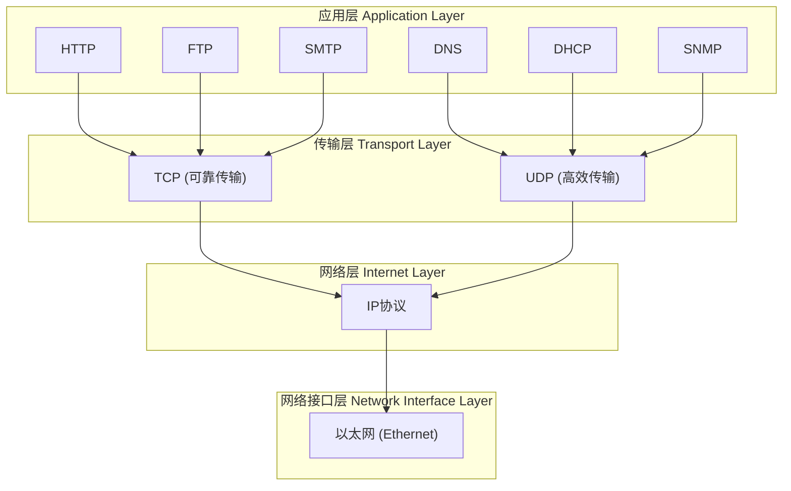

## TCP 三次握手和四次挥手

TCP（传输控制协议）是一种面向连接的、可靠的、基于字节流的传输层通信协议。“连接”的建立和终止是 TCP 可靠性的基石，这两个过程分别通过三次握手和四次挥手来完成。

---

一、TCP 三次握手 (建立连接)

目的：在客户端和服务器之间建立可靠的连接，同步序列号（Sequence Number, SEQ）和确认号（Acknowledgment Number, ACK），并交换 TCP 窗口大小信息。

过程（假设客户端为 Client，服务器为 Server）：

1. 第一次握手 (SYN)
   · 动作：Client 向 Server 发送一个 TCP 数据包。
   · 标志位：设置 SYN = 1（表示请求建立连接）。
   · 序列号：随机生成一个初始序列号 seq = x。
   · 状态变化：
     · Client 进入 SYN-SENT (同步已发送) 状态。
     · Server 仍然处于 LISTEN (监听) 状态。
2. 第二次握手 (SYN + ACK)
   · 动作：Server 收到 Client 的 SYN 包后，如果同意连接，则回复一个数据包。
   · 标志位：设置 SYN = 1 和 ACK = 1。
   · 序列号：随机生成自己的初始序列号 seq = y。
   · 确认号：设置 ack = x + 1（表示期望下次收到从 x+1 开始的报文，同时也确认了收到了 Client 的序列号 x）。
   · 状态变化：Server 进入 SYN-RCVD (同步已收到) 状态。
3. 第三次握手 (ACK)
   · 动作：Client 收到 Server 的 SYN-ACK 包后，会再发送一个确认包。
   · 标志位：设置 ACK = 1。（此时 SYN = 0，因为连接已基本建立）
   · 序列号：seq = x + 1（因为第一次握手消耗了一个序列号）。
   · 确认号：设置 ack = y + 1（表示期望下次收到从 y+1 开始的报文，确认了 Server 的序列号 y）。
   · 状态变化：
     · Client 进入 ESTABLISHED (连接已建立) 状态。
     · Server 收到这个 ACK 包后，也进入 ESTABLISHED 状态。

至此，连接建立成功，双方可以开始传输数据。

为什么是三次，而不是两次？ 核心原因：防止已失效的连接请求报文突然又传送到服务器，从而产生错误。 假设只有两次握手：如果 Client 发出的第一个 SYN 报文因为网络拥堵延迟了，Client 会超时重发一个 SYN 并成功建立连接。数据传输完毕后，这个延迟的 SYN 报文才到达 Server。Server 会误以为 Client 又发起了新连接，于是回应 SYN-ACK 并一直等待 Client 发送数据，导致 Server 的资源被白白浪费。而采用三次握手，Client 不会对那个延迟的 SYN-ACK 进行确认，Server 收不到确认就会关闭这个无效的请求。

---

二、TCP 四次挥手 (终止连接)

目的：双方共同协商，安全地关闭一个 TCP 连接。由于 TCP 连接是全双工的（数据可以双向传输），每个方向都必须单独进行关闭。

过程（假设客户端主动关闭，服务器被动关闭）：

1. 第一次挥手 (FIN)
   · 动作：Client 认为自己数据已发送完毕，希望关闭连接。它发送一个数据包。
   · 标志位：设置 FIN = 1（表示请求终止连接）。
   · 序列号：seq = u（u 是上一个已传输字节的序列号 + 1）。
   · 状态变化：Client 进入 FIN-WAIT-1 (终止等待1) 状态。
2. 第二次挥手 (ACK)
   · 动作：Server 收到 FIN 包后，立即发送一个确认包。
   · 标志位：设置 ACK = 1。
   · 确认号：ack = u + 1。
   · 状态变化：
     · Server 进入 CLOSE-WAIT (关闭等待) 状态。
     · 此时，TCP 连接处于半关闭状态 (Half-Close)。Client 到 Server 方向的连接关闭了，Client 不能再发送数据，但 Server 到 Client 方向的连接仍然打开，Server 可能还有数据要发送给 Client。
   · Client 收到这个 ACK 后，进入 FIN-WAIT-2 (终止等待2) 状态，等待 Server 发送 FIN 包。
3. 第三次挥手 (FIN)
   · 动作：当 Server 也完成了所有数据的发送后，它发送一个 FIN 包。
   · 标志位：设置 FIN = 1 (通常还会带上 ACK = 1)。
   · 序列号：seq = w（w 可能等于 u+1，也可能更大，取决于第二次挥手后 Server 是否又发送了数据）。
   · 确认号：ack = u + 1（保持不变）。
   · 状态变化：Server 进入 LAST-ACK (最后确认) 状态。
4. 第四次挥手 (ACK)
   · 动作：Client 收到 Server 的 FIN 包后，发送一个确认包。
   · 标志位：设置 ACK = 1。
   · 序列号：seq = u + 1。
   · 确认号：ack = w + 1。
   · 状态变化：
     · Client 发送完 ACK 后，进入 TIME-WAIT (时间等待) 状态。
     · Server 收到这个 ACK 后，立即进入 CLOSED (关闭) 状态。
   · Client 在 TIME-WAIT 状态会等待 2MSL (Maximum Segment Lifetime，报文最大生存时间，通常为 2 分钟) 后，才进入 CLOSED 状态。

为什么需要 TIME-WAIT 状态和等待 2MSL？

1. 可靠地终止连接：确保 Client 发送的最后一个 ACK 能到达 Server。如果这个 ACK 丢失，Server 会在超时后重发 FIN。这时还在 TIME-WAIT 状态的 Client 可以重发 ACK，否则 Client 直接关闭，Server 会一直处于 LAST-ACK 状态。
2. 让旧连接的报文在网络中消逝：等待 2MSL 时间，可以确保本次连接所产生的所有报文都从网络中消失，从而不会影响后续建立的新连接。

为什么挥手是四次？ 因为建立连接时，SYN 和 ACK 可以合并在一起发送（SYN-SENT 和 SYN-RCVD 状态可以快速转换）。但关闭连接时，当收到对方的 FIN 报文，仅仅表示对方不再发送数据了，但还可以接收数据。己方可能还有数据要发送，所以不能立即关闭 socket，必须先发送一个 ACK。等待己方所有数据都发送完毕后，再发送 FIN 报文给对方。因此，ACK 和 FIN 在大多数情况下不能合并发送，需要分两次进行，这就导致了四次挥手。

---

总结与图示

阶段 次数 发送方 标志位 目的
三次握手 第一次 Client SYN=1 发起连接，同步序列号
 第二次 Server SYN=1, ACK=1 确认客户端的 SYN，同步自己的序列号
 第三次 Client ACK=1 确认服务器的 SYN，连接建立
四次挥手 第一次 Client (主动方) FIN=1 请求关闭连接
 第二次 Server (被动方) ACK=1 确认收到关闭请求
 第三次 Server (被动方) FIN=1 数据发送完毕，也请求关闭连接
 第四次 Client (主动方) ACK=1 确认收到关闭请求，连接彻底关闭

希望这个详细的解释能帮助你彻底理解 TCP 的三次握手和四次挥手！

## 协议及其所在的层次。

网络协议通常按照 OSI 模型（7层）或更实用的 TCP/IP 模型（4层）来划分。为了更直观地理解，下图展示了这些常用协议在分层模型中的位置及其相互关系：

---

各层详细说明

1. 应用层 (Application Layer)

· 职责：为应用程序提供网络服务接口，定义数据格式和用户交互规则。
· 协议举例：
  · HTTP：用于网页浏览。
  · HTTPS：加密的HTTP。
  · FTP：用于文件传输。
  · SMTP/POP3/IMAP：用于发送和接收电子邮件。
  · DNS：用于域名解析。
  · DHCP：用于自动分配IP地址。
  · SNMP：用于网络管理。

2. 传输层 (Transport Layer)

· 职责：为应用层提供端到端（进程到进程）的通信服务，主要负责数据分段、流量控制和差错控制。
· 核心协议：
  · TCP (传输控制协议)：提供面向连接的、可靠的数据传输服务。就像打电话，需要建立连接，保证对方能听到且顺序正确。
  · UDP (用户数据报协议)：提供无连接的、不可靠的数据传输服务。就像发短信，直接发送，不保证对方一定能收到或按顺序收到。

3. 网络层 (Internet Layer)

· 职责：负责将数据包从源主机跨网络路由到目标主机。进行逻辑寻址（IP地址）和路径选择。
· 核心协议：
  · IP (网际协议)：是互联网的基石协议，负责封装数据包并为其指定源IP地址和目标IP地址。IP协议不提供可靠性保证。
  · ICMP：用于网络诊断和错误报告（如 ping 命令）。
  · ARP：用于通过IP地址发现对应的MAC地址。

4. 网络接口层 (Network Interface Layer)

· 职责：负责在同一局域网内通过物理网络（如以太网、Wi-Fi）传输数据。进行物理寻址（MAC地址）。
· 核心概念：
  · 以太网 (Ethernet)：最常见的局域网技术。
  · MAC 地址：网卡的物理地址，全球唯一。

---

数据封装过程：以发送邮件为例

当您发送一封邮件时，数据是如何被包裹的：

1. 应用层：您的邮件内容（Hello!）和收件人信息被加上 SMTP 协议的头部（信封上的地址、邮编）。
2. 传输层：SMTP数据被交给 TCP。TCP将其分段，并加上TCP头部（包含源端口和目的端口，就像指定是哪个部门收信）。
3. 网络层：TCP段被交给 IP。IP加上IP头部（包含源IP和目标IP，就像收发信人的具体街道地址）。
4. 网络接口层：IP数据包被交给 以太网。以太网加上帧头和帧尾，包含源MAC和目标MAC地址（就像本地的邮递员根据门牌号投递）。

这个包裹好的数据帧最终被转换成比特流，通过网线或无线电波发送出去。接收方则反向操作，一层层拆开包裹，最终将 Hello! 呈现给用户。

总结对比

协议/概念 主要所属层 核心功能 类比
HTTP, DNS, SMTP 应用层 规定应用程序的数据格式 信的内容（中文、格式）
TCP, UDP 传输层 端到端通信，可靠性保证 快递服务（顺丰/EMS，是否保价、跟踪）
IP, ICMP 网络层 逻辑寻址和路由 地址和路由（发往哪个城市、走哪条路）
Ethernet, MAC 网络接口层 物理寻址和介质访问 本地投递（某个街道、某个门牌号）

希望这个解释和图表能帮助您清晰地理解网络协议的分层结构！